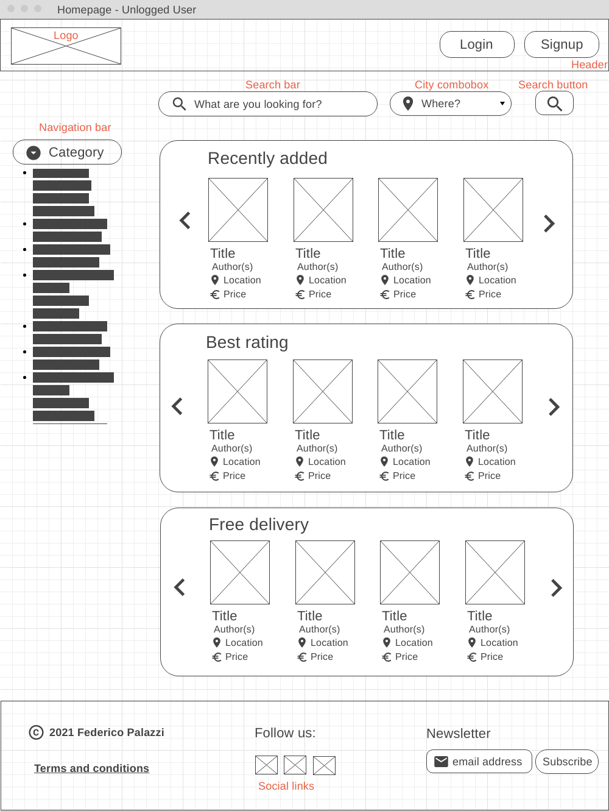
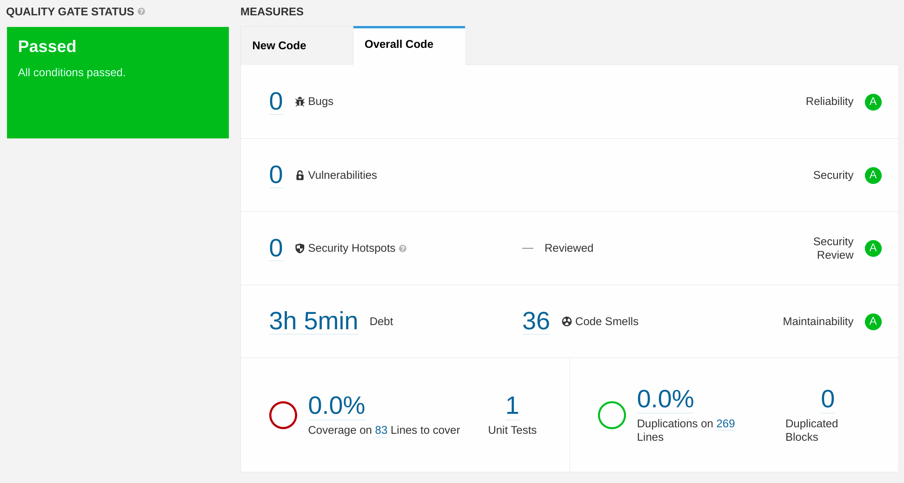

# Read4Share

[TOC]

## Versioning table

| Version | Date       | Author     | Changes                                                   |
| :------ | ---------- | ---------- | --------------------------------------------------------- |
| 1.0     | 15/09/2021 | F. Palazzi | Initial version                                           |
| 1.1     | 16/09/2021 | F. Palazzi | Added intro, user stories and acceptance criteria section |
| 1.2     | 17/09/2021 | F. Palazzi | Added UML Diagrams section, updated User Stories          |
| 1.3     | 29/09/2021 | F. Palazzi | Added additional User Stories                             |
| 1.4     | 10/10/2021 | F. Palazzi | Added C4 diagrams section                                 |
| 1.5     | 01/11/2021 | F. Palazzi | Created design document                                   |
| 1.6     | 15/11/2021 | F. Palazzi | Added endpoints list                                      |
| 1.7     | 26/11/2021 | F. Palazzi | Added test plan                                           |
| 1.8     | 05/12/2021 | F. Palazzi | Added pipeline setup diagram, research document           |
| 1.9     | 16/12/2021 | F. Palazzi | Added OWASP Security report                               |
| 2.0     | 06/01/2022 | F. Palazzi | Added UX Feedback Report, Cultural awareness document     |

## Intro

The goal of this project is to create an online platform that allows general users (especially students) to share new and second-hand books, either in free form or asking an amount of money.

This platform doesn't aim to handle an eventual payment for the books exchange, but it will permit sellers and buyers to keep in touch each other through an online chat system.

### Example of operation

- A user (the *seller*) wants to sell a book that he owns; the web app will allow him to create a new advertisement and to insert all the book's info (title, authors, ISBN, etc...).
-  Another user (the *buyer*) has seen a book advertisement and he would like to buy it; the web platform will allow him to contact the buyer through a chat panel.

### Build instructions

1. Clone the repository with either [HTTPS](https://gitlab.com/IlPalazz/read4share.git) or [SSH](git@gitlab.com:IlPalazz/read4share.git)
2. Open the terminal and navigate to the project directory (or open it with an IDE)
3. Run the `./gradlew build` command inside the "read4share" folder to build the backend project
3. Run the `ng serve` command inside the "read4share-frontend" folder to build the frontend project

## Backlog

### Types of users

- `viewer` - unregistered / unlogged user
- `seller` - user who wants to sell / share a book
- `buyer` - user who wants to buy a book
- `admin` - administrator of the platform

### User stories & Acceptance criteria

[Click to view](docs/stories.md)

## Design document & Applied research

- [Design document](./docs/design_doc.md)
- [Applied research document](./docs/applied_research.md)

## Test plan

[Click to view](docs/testplan.md)

## Endpoints

[Click to view](docs/endpoints.md)

## UI Mockups

    
Homepage

    

## UX feedback report

[Click to view](docs/ux_report.md)

## SonarQube Scan

    
Click to expand

    

## OWASP Security report

[Click to view](docs/owasp_report.md)

## Cultural awareness document

[Click to view](docs/cultural_awareness.md)

## External resources

- [Jira Software](https://strykerstorm.atlassian.net/jira/software/projects/R4S/boards/2/roadmap?shared=&atlOrigin=eyJpIjoiYjQzM2IwMDIxZDFiNDdkYzg5N2ZmNjU4ZTdlZGJjNTciLCJwIjoiaiJ9) - issue tracking product
- [Gitlab repository](https://gitlab.com/IlPalazz/read4share) - archive of source files and documentation
- [IntelliJ IDEA](https://www.jetbrains.com/idea/) - Java IDE
- [SonarQube](https://www.sonarqube.org/) - Static code quality metrics analyzer

## Credits

- Federico Palazzi (*author*)