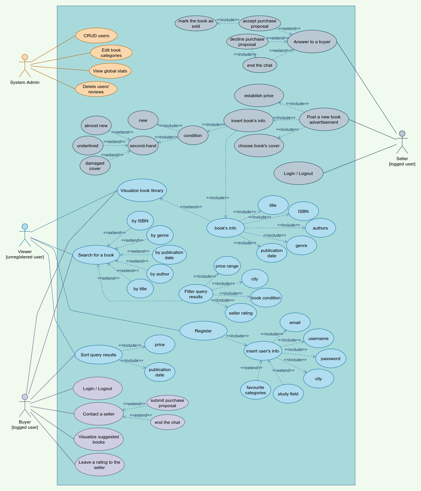

# Read4Share

[TOC]

## Versioning table

| Version | Date       | Author     | Changes                                                   |
| :------ | ---------- | ---------- | --------------------------------------------------------- |
| 1.0     | 15/09/2021 | F. Palazzi | Initial version                                           |
| 1.1     | 16/09/2021 | F. Palazzi | Added intro, user stories and acceptance criteria section |
| 1.2     | 17/09/2021 | F. Palazzi | Added UML Diagrams section, updated User Stories          |

## Intro

The goal of this project is to create an online platform that allows general users (especially students) to share new and second-hand books, either in free form or asking an amount of money.

This platform doesn't aim to handle an eventual payment for the books exchange, but it will permit sellers and buyers to keep in touch each other through an online chat system.

### Example of operation

- A user (the *seller*) wants to sell a book that he owns; the web app will allow him to create a new advertisement and to insert all the book's info (title, authors, ISBN, ecc...).
-  Another user (the *buyer*) has seen a book advertisement and he would like to buy it; the web platform will allow him to contact the buyer and it will help him to make a purchase proposal for the book.

### Build instructions

1. Clone the repository with either [HTTPS](https://gitlab.com/IlPalazz/read4share.git) or [SSH](git@gitlab.com:IlPalazz/read4share.git)
2. Open the terminal and navigate to the project directory (or open it with an IDE)
3. Run the `./gradlew build` command to build the project

## Backlog

### Types of users

- `viewer` - unregistered / unlogged user
- `seller` - user who wants to sell / share a book
- `buyer` - user who wants to buy a book
- `admin` - administrator of the platform

### User stories & Acceptance criteria

#### As a *viewer* I want to...

- visualize the entire book library so that I can choose something interesting for me `[Priority: 7, Estimation: 6h]`
  1. **Given that** I want to visualize books which belong to a certain category, **when** I select the category **then** the system presents a list of all books that match the criteria spread over several pages.
- search for a specific book that I am interested in `[Priority: 6, Estimation: 4h]`
  1. **Given that** I enter at least one of the book's info (title, author, ISBN), **when** I click the *Search button* or I press enter **then** the system displays the results of my query.
- filter the query results so that I can find the book I am looking for more easily `[Priority: 6, Estimation: 5h]`
  1. **Given that** I choose at least one of the available filters (price range, city of the seller, book condition, seller rating), **when** I change one of the filter **then** the system changes the results dynamically according to my preferences.
- sort the query results so that I can find at the top of the list the books I am looking for `[Priority: 5, Estimation: 3h]`
  1. **Given that** I choose a sorting order, **when** I change the type of sorting **then** the system updates the views according to my selections.
- create a personal account so that I can chat with sellers in order to buy a book `[Priority: 9, Estimation: 8h]`
  1. **Given that** I am a new user of the platform, **when** I click the *Signup button* and I insert my data **then** the system creates a new user account and it will authenticate me.
  2. **Given that** I am already registered on the platform, **when** I click the *Signup button* and I insert my data **then** the system notifies me that the account already exists and it offers me the possibility to recover the password through my email.

#### As a *buyer* I want to...

- have a Login Validation functionality so that I can access my personal info safely `[Priority: 9, Estimation: 6h]`
  1. **Given that** I am a valid user, **when** I enter username and password and click the *Login button* **then** the system redirects the user to the home page.
  2. **Given that** I am an invalid user **when** I enter username and password and click the *Login button* **then** the system throws an *invalid user* error message.
  3. **Given that** I am already logged in, **when** I access the web platform **then** the system should not ask me to reinsert my credentials.
- logout from the current session so that no one else can access my account `[Priority: 9, Estimation: 4h]`
  1. **Given that** I am logged into my account, **when** I click the *Logout button* **then** the system disconnects my current session and redirects me back to the home page.
  2. **Given that** I am not logged into my account, **when** I search for the *Logout button* **then** the system hides it from me.
- contact a seller so that I can get more info about the book and, eventually, buy it `[Priority: 6, Estimation: 10h]`
  1. **Given that** I am logged in, **when** I click the *Contact button* in order to talk to a seller **then** the system opens the chat panel and starts a chat with the specified seller.
  2. **Given that** I am not logged in, **when** I click the contact button in order to talk to a seller **then** the system redirects me to the *Login / Register* page.
- submit a purchase proposal so that I can buy the book I was looking for `[Priority: 5, Estimation: 8h]`
  1. **Given that** I am logged in and I have already contacted the seller, **when** I click the *Submit a purchase proposal button* in the chat panel **then** the system notifies the seller and it prints a message inside the chat.
- visualize the chat panel so that I can scroll and read the chat history with all the sellers that I have contacted `[Priority: 5, Estimation: 8h]`
  1. **Given that** I am logged in and I have never contacted a seller, **when** I click the *Chat button* **then** the system opens the chat panel with the empty template.
  2. **Given that** I am logged in and I have contacted at least one seller, **when** I click the *Chat button* **then** the system opens the chat panel and shows me the chat history.
- visualize a list of suggested books so that I can choose one among them `[Priority: 3, Estimation: 8h]`
  1. **Given that** I am logged in and I have provided one or more fields of interest during the registration process, **when** I visit the website home page **then** the system shows me the *Suggested books panel* based on my interests.
- leave a rating to the seller so that I can share my purchase experience with other users `[Priority: 3, Estimation: 5h]`
  1. **Given that** I bought a book from a seller, **when** I open the chat panel and click on the seller's chat **then** the system allows me to leave rating from 1 star up to 5.

#### As a *seller* I want to...

- receive a notification every time a buyer contact me so that I can quickly reply to him `[Priority: 4, Estimation: 6h]`
  1. **Give that** I receive a new message from a buyer, **when** I enter the website homepage **then** the system shows me a notification counter of the unread messages.
  2. **Given that** I am not using the web platform, **when** a new buyer contact me through the chat **then** the system sends me an email notification telling me that a new buyer wants to contact me.
  3. **Given that** I am not using the web platform, **when** a buyer reply to an already started conversation in the chat **then** the system sends me an email notification telling me that the buyer replied to the last message.
- post a new advertisement so that buyers can see it and contact me `[Priority: 8, Estimation: 6h]`
   	1. **Given that** I am logged in, **when** I click the *New Advertisement button* **then** the system redirects me to the sale page where I can insert all the book's info.
   	2. **Given that** I have clicked the *New Advertisement button* and I have inserted all the required info, **when** I press the *Post advertisement button* **then** the system:
       - creates the advertisement and displays it in the web platform
       - redirects me to the *My sales* page
       - notifies me in case of either success or error during the request handling
  	3. **Given that** I have clicked the *New Advertisement button* and I have not inserted all the required info, **when** I press the *Post advertisement button* **then** the system notifies me of some missing fields to complete.
- accept a purchase proposal so that I can sell the book to the buyer `[Priority: 6, Estimation: 4h]`
   	1. **Given that** I receive a purchase proposal from a user, **when** I click the *Accept proposal button* **then** the system:
       - marks the book as sold
       - removes the advertisement from the active ones on the platform
       - adds the book to the seller's personal list of sold items
       - notifies the buyer that the seller has accepted the request
- decline a purchase proposal so that I can reject offers I am not interested in `[Priority: 6, Estimation: 4h]`
  1. **Given that** I receive a purchase proposal from a user, **when** I click the *Reject proposal button* **then** the system:
     - notifies the buyer that the seller has rejected the proposal
     - prints a message in the chat between the two users
     - ends the chat

#### As an *admin* I want to...

- have the control over users' account (create, modify, delete, update) so that I can resolve issues `[Priority: 3, Estimation: 8h]`
  1. **Given that** I have a valid admin account, **when** I access the admin control panel **then** the system allows me to add a new user to the platform, delete an existing one, view and update an existing user's info.
- edit the book categories so that I can add new categories that are not present in the platform yet `[Priority: 2, Estimation: 4h]`
  1. **Given that** I have a valid admin account, **when** I access the admin control panel **then** the system allows me to add new books categories and to update their info.

## UML Diagrams

### Use Case

    
Click to expand

    

## Test plan

- Unit tests

## External resources

- [Jira Software](https://strykerstorm.atlassian.net/jira/software/projects/R4S/boards/2/roadmap?shared=&atlOrigin=eyJpIjoiYjQzM2IwMDIxZDFiNDdkYzg5N2ZmNjU4ZTdlZGJjNTciLCJwIjoiaiJ9) - issue tracking product --> TODO: insert user stories in Jira's Backlog

## Credits

- Federico Palazzi (*author*)

