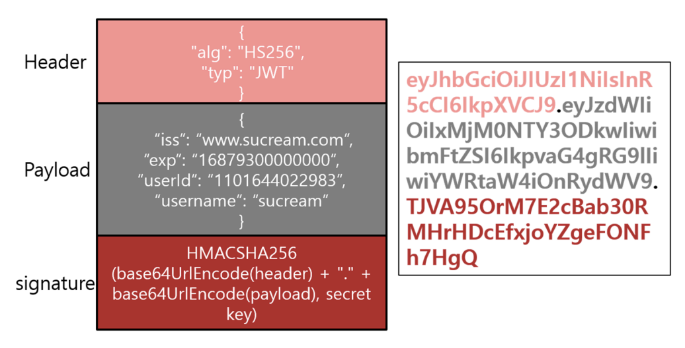
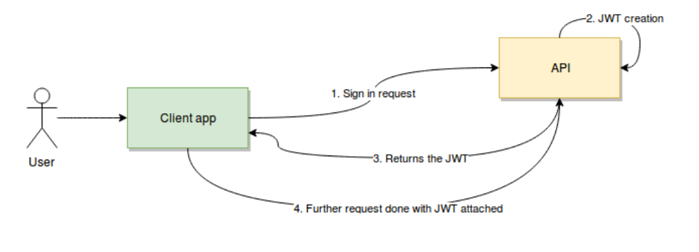
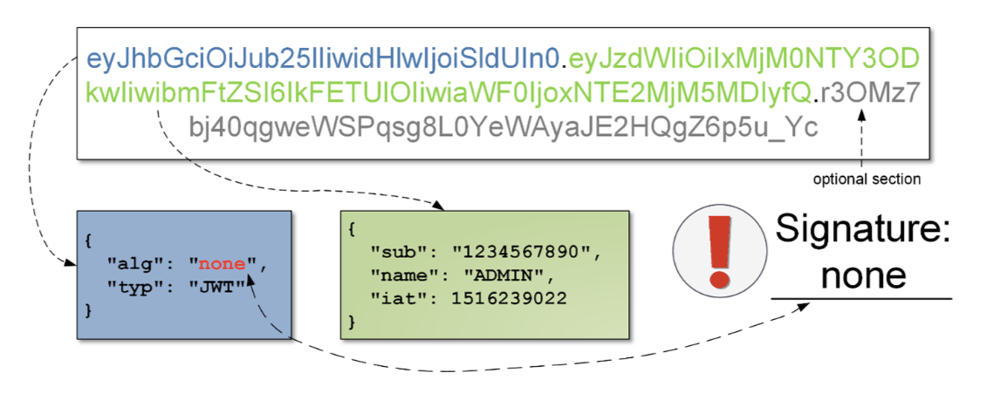
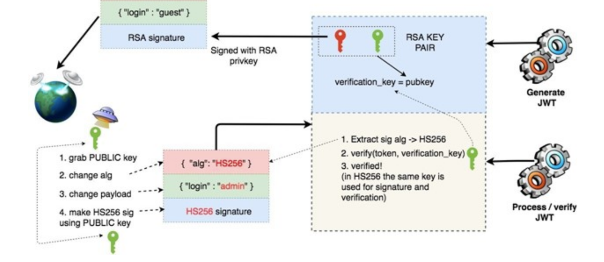
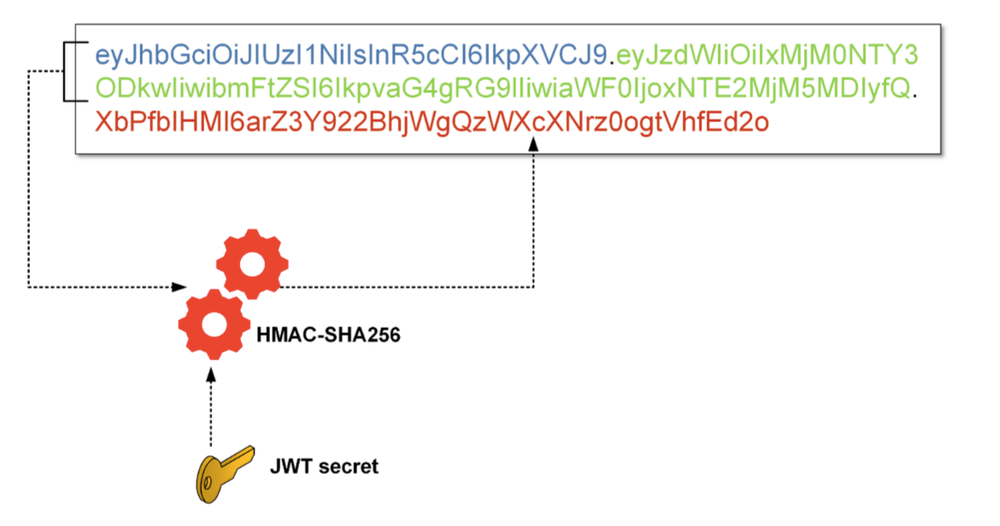

# Applied research document

[TOC]

## Topic

Web security - how to use the JSON web token in a secure way in front and back-end.

## Main question

How can JWT help to secure a REST API?

## Subquestions and DOT Framework methods

1. What are REST APIs?
   - <u>*Available product analysis*</u> - It is easier to give a definition of REST API looking at the already existing solutions.
   - <u>*Community research*</u> - Incorporating your peers’ knowledge can speed the research up.
   - <u>*Literature study*</u> - To understand the topic we should find general information and guidance.
2. What is a JWT?
   - <u>*Available product analysis*</u> - It is easier to give a definition of JWT looking at the already existing solutions.
   - <u>*Community research*</u> - Incorporating your peers’ knowledge can speed the research up.
   - <u>*Literature study*</u> - To understand the topic we should find general information and guidance.
3. How can we assure authentication and authorization using JWT?
   - <u>*Problem analysis*</u> - Before solving a problem, it is important to understand it. Moreover, problem analysis ensures that you are not solving the wrong problem.
   - <u>*Best, good and bad practices*</u> - In order to assure the security of our application, it is important to aware of the best and bad practices.
   - <u>*Design pattern research*</u> - Applying well-known design patterns improves the quality (and structure) of the designed software.
4. What are the main drawbacks of a JWT Auth solution?
   - <u>*Literature study*</u> - If we want to find drawbacks to this solution we should first find general information, guidance and best practices.
   - <u>*Explore user requirements*</u> - The drawbacks can have different relevance according to the final user and his needs.
   - <u>*Security test*</u> - Performing security tests is a good idea to minimize risks and guarantee confidentiality, integrity and availability of information.

## Subquestions answers

1. **What are REST APIs?**

   An API, or *application programming interface*, is a set of rules that define how applications or devices can connect to and communicate with each other. A REST API is an API that conforms to the design principles of the REST, or *representational state transfer* architectural style. 

   They can be developed using virtually any programming language and support a variety of data formats but they have to align to the following *REST design principles*:

   - **Uniform interface** - All API requests for the same resource should look the same, no matter where the request comes from.
   - **Client-server decoupling** - In REST API design, client and server applications must be completely independent of each other. The only information the client application should know is the URI of the requested resource; it can't interact with the server application in any other ways.
   - **Statelessness** - REST APIs are stateless, meaning that each request needs to include all the information necessary for processing it.
   - **Cacheability** - When possible, resources should be cacheable on the client or server side.
   - **Layered system architecture** - REST APIs need to be designed so that neither the client nor the server can tell whether it communicates with the end application or an intermediary.

   REST APIs communicate via HTTP requests to perform standard database functions like creating, reading, updating, and deleting records (also known as CRUD) within a resource. For example, a REST API would use a GET request to retrieve a record, a POST request to create one, a PUT request to update a record, and a DELETE request to delete one. All HTTP methods can be used in API calls.

2. **What is a JWT?**

   JWT is a token authentication system that encodes data in JSON format to base64 with the technique specified in [RFC 7519](https://datatracker.ietf.org/doc/html/rfc7519). 

   As shown in the following figure, JWT consists of three sections: header, payload, and signature, and each section is separated by a (dot) operator. 

   

   The **header** section specifies the type of token and the hash algorithm to use for the JWT signature. 

   The **payload** section is where the actual information for the token to be used is stored. The information is a pair of names and values, and can store arbitrary data, such as the token issuer, token expiration time, and user information. 

   The **signature** section allows the token issuer to sign the token using a hash-based message authentication code (HMAC), RSA, etc., to maintain the integrity of the token. 

   When applying the HMAC, the header and payload section values are encoded in base64, and signatures are applied using hash HMAC using the secret key created in advance. When RSA is applied, the header section and payload section values can be encrypted and signed using the RSA private key of the token issuer. 

3. **How can we assure authentication and authorization using JWT?**

   

   1. The user / client app sends a sign-in request. In other words, here is where your username/password (or any other type of sign-in credentials you need to provide) will travel.
   2. Once verified, the API will create a JSON Web Token and sign it using a secret key (an encoded string).
   3. The API will return that token back to the client application.
   4. Finally, the client app will receive the token, verify it on its own side to make sure it’s authentic, and then proceed to use it on every subsequent request to authenticate the user without having to send their credentials anymore.

   The client application, upon receiving this token, can decipher it and validate it by grabbing the header and payload portions and signing it on its own (this is possible because both client and server know the secret phrase). Doing this can ensure that no one changed the content of the message and that it’s safe to use it.

   At the same time, any further request sent by the client app will contain this same token, which will be validated by the server by re-signing it every time and comparing results with the signature portion of the token.

   In a typical JWT request, the token will be passed as part of the authorization header on the client-side after the client must have logged in, like so: `Authorization: Bearer`.

   This would prevent, for example, someone from meddling with the message’s payload and changing the “admin” attribute to “true” allowing a fake (or even a valid non-admin user) to execute a privileged action (such as issuing a payment to some specific employee).

4. **What are the main drawbacks of a JWT Auth solution?**

   If JWT is not implemented properly, there are ways that an attacker can bypass the security mechanism and forge arbitrary tokens:

   - **None algorithm**

     JWT supports **“none”** algorithm. Any token would be considered valid if the **alg** field is set to “none” and signature section is set to empty. This feature was originally used for debugging purposes and if not turned off in a production environment, it would allow attackers to forge any token by setting the **alg** field to “none”.

     

   - **HMAC algorithm**

     The most commonly used algorithms for JWTs are HMAC and RSA. In RSA algorithm implementation of JWTs, private keys are used by the server to sign the payload, and clients can verify the JWT using the public key. Similarly, the server will use the public key to confirm the integrity of JWT upon receiving it from a client. The vulnerability occurs if a server’s code is expecting a token with “alg” set to RSA but receives a token with “alg” set to HMAC. It might use the public key as HMAC symmetric key while verifying the signature. As the public key would be revealed, the attacker could modify payloads, sign using obtained public key, change “alg” to HMAC, and then be able to forge JWTs.

     

   - **Secret Key Brute Force**

     If the “HS256” algorithm is used, the payload is signed with an HMAC using SHA-256 with a symmetric key. A valid JWT has both a payload and a valid signature for that payload. Various symmetric keys could be brute forced by using tools like hashcat, and the signature result is compared to the known-valid signature in order to discover the symmetric key.

     

   - **Sensitive Information Leak**

     It is possible for sensitive data like SSN number, credit card number, etc., to be contained in a JWT’s payload and go unnoticed because of Base64 encoding. 

   - **Open Redirection**

     Many Single Sign-On solutions use JWTs to track user’s authentication status. In a typical setup, a user authenticates on the authentication server and is redirected to the end application, along with a JWT to prove their authenticity. The end application then verifies the user’s authenticity by validating the JWT against authentication server. It is possible to manipulate where users were redirected after authentication, allowing attackers to redirect users and their JWT to a server controlled by the attacker, thus stealing their JWT and session.

## Conclusion

JWT is a very popular standard which can be used to trust requests through signatures, and exchange information between parties. From this research I have learned how to secure a REST API with JWT, how to provide authentication and authorization functionality to the final users of my app, how the entire process of token issuing and validation works and some best practices to keep in mind while implementing a JWT based solution, such as:

- Always perform Algorithm Verification.

- Use appropriate algorithms.

- In the case of nested tokens, perform all validation steps as declared in the headers of each token.

- Validate the inputs for all the parameters in JWT.

- Do not store sensitive information in JWT token.

- Different validation rules must be applied for each token.

## Links and references

- *IBM Cloud Education, (2021, April 6), "REST APIs". https://www.ibm.com/cloud/learn/rest-apis* 
- *LogRocket, (2021, March 1), "**How to secure a REST API using JWT**", https://blog.logrocket.com/how-to-secure-a-rest-api-using-jwt-7efd83e71432/*
- *Namsu Hong, Mansik Kim, Moon-Seog Jun and Jungho Kang, (2017, June 23), "A Study on a JWT-Based User Authentication and API Assessment Scheme Using IMEI in a Smart Home Environment", https://pdfs.semanticscholar.org/3780/2344036753d63ae4bbca074d3cd19e4d2b33.pdf*
- *Divya Shankari N, (2021, July 1), "Hacking JSON Web Tokens", https://long-80.com/blog/hacking-json-web-tokens/*
