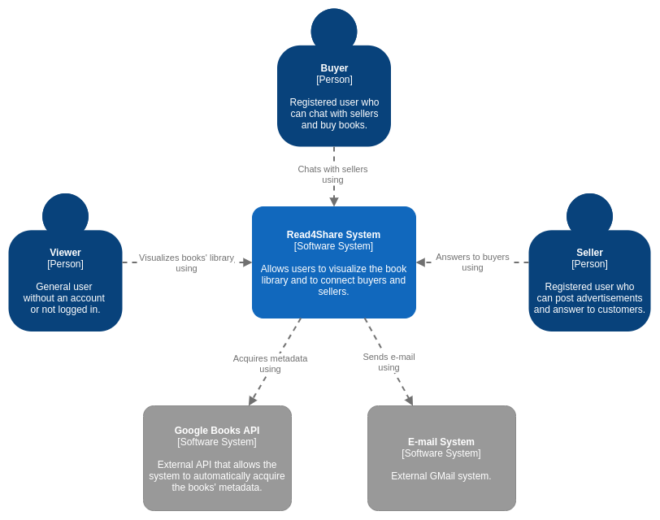
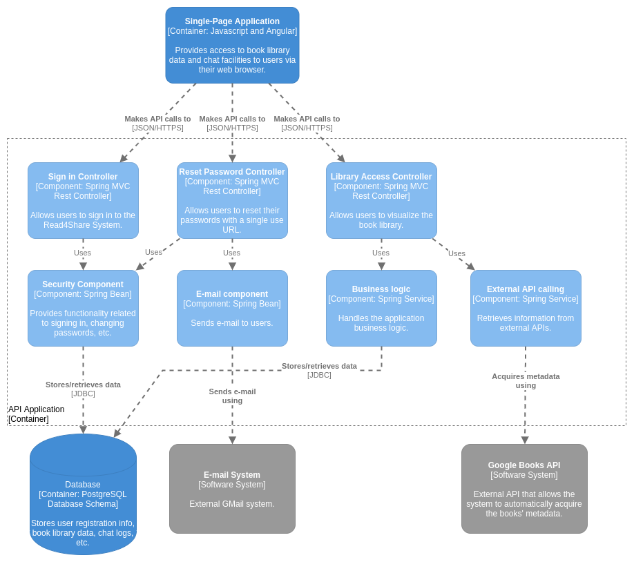

# Design document

## Design decisions

The application has been built following a client-server architecture and it presents a frontend layer and a backend layer.

- **Frontend**

  I have chosen the *Angular* Javascript framework to build the user interface for several reasons:

  - it is open-source platform created by Google;
  - it has lots of built-in features and a rich documentation;
  - it provides very high performance.

-  **Backend**

    Spring Boot is a popular Java based framework to build web and enterprise applications which provides a wide variety of features that address the modern business needs:

    - it offers an effortless way to create spring-based applications using JAVA;
    - it helps in reducing all the manual work of writing annotations, boilerplate codes and XML configurations;
    - it provides easy access to Embedded HTTP servers such as Tomcat;
    - it also provides a lot of plugins which aids in effortless development and testing of Spring Boot application build with the help of tools like Gradle and Maven.

    For the above reasons I have chosen to use it as backend development framework for my individual project.

-  **Database**

    In order to store and retrieve my application's data I will use PostgreSQL because it offers a lot of features:

    - it is open source and community driven;
    - there are many features for enhanced security, thanks to easy extensibility;
    - PostgreSQL database can grow with you, and can be as large as you need it to go, so it allows you to easily scale your application.

- **Separation of concerns**

  The *separation of concerns* is a design principle for separating a computer program into distinct sections. Each section addresses a different concern, which is a set of information that affects the code of a program.

  According to the SOLID principles, in particular the "*single-responsibility"*, every module, class or in a computer program should have responsibility over a single part of that program's functionality and it should encapsulate that part.

  I have designed my application using the separation of concerns, in particular I have adopted the MVC approach with a *Controller* class that handles requests from clients, a *Service* which represents the application business logic, and a *Data Access Object (DAO)* that provides an abstract interface to some type of databases or other persistence mechanism.

  When concerns are well-separated, there are more opportunities for module upgrade, reuse, and independent development. Hiding the implementation details of modules behind an interface enables improving or modifying a single concern's section of code without having to know the details of other sections and without having to make corresponding changes to those other sections.

## C4 Diagrams

### System Context (C1)

    
Click to expand

    

### Containers (C2)

    
Click to expand

    

### Components (C3)

    
Click to expand

    

### Code (C4) - Class diagram

*TODO*

## Applied research

