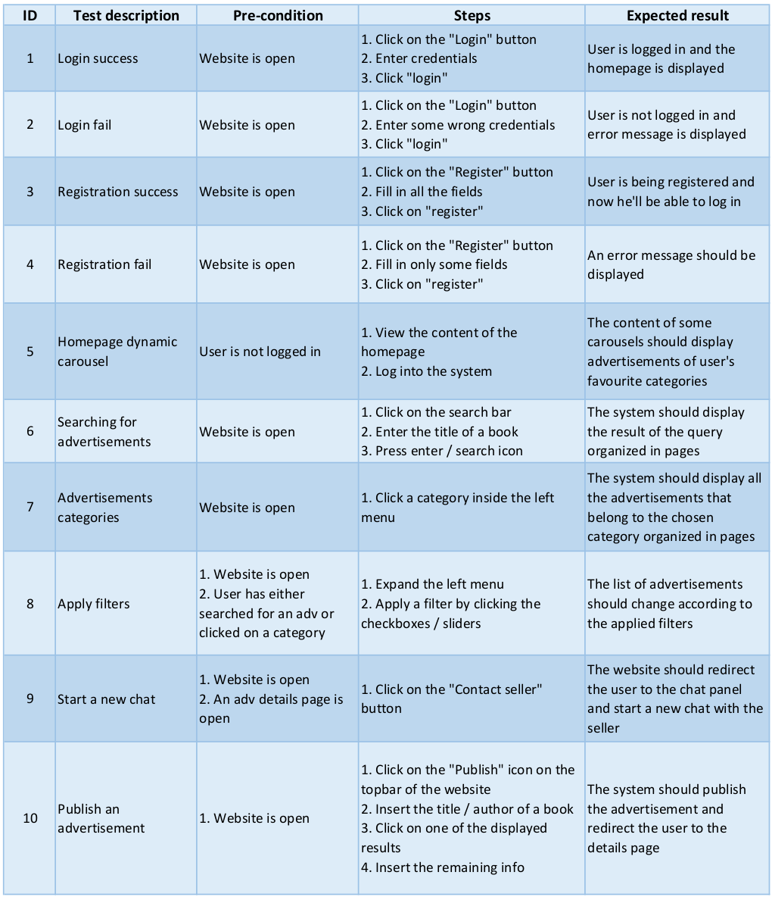

# Test plan

[TOC]

## Test strategy

### Scope

- **in scope**: software components of the system, both in the frontend and backend part, using different and specific types of tests.
- **out of scope**: database testing, performance testing, smoke testing

### Testing types

- **Unit tests**: testing of individual methods and functions of the classes, components or modules. They are quite cheap to automate and can be run very quickly by a CI server.
- **Integration tests**: testing of different group of modules or services in order to verify whether they work well together (for example, it can be testing the interaction with the database). These types of tests are more expensive to run as they require multiple parts of the application to be up and running.
- **Functional tests**: testing focused on the business requirements of the application. As opposed to integration tests, they only verify the output of an action and do not check the intermediate states of the system when performing that action.
- **End-to-end tests**: testing replicates a user behavior with the software in a complete application environment. It verifies that various user flows work as expected and can be as simple as loading a web page or logging in. They are expensive to perform and can be hard to maintain when they are automated.
- **User Acceptance tests**: testing whether the application is working for the user, correctly for the usage. Specific requirements which are quite often used by the end-users are primarily picked for the testing purpose.

## Test Objectives

- Check that the connections among the various software components (Angular frontend, Spring Boot backend, PostgreSQL DB) are working correctly.
- Check that the UI functionality is working as expected without any errors or bugs.
- Verify the usability of the website and assure that it meets the users' needs.
- Check that single units or modules in the backend are being executed correctly.
- Check that groups of modules in the backend work correctly together.

## Test exit criteria

- All the unit and integration tests on the backend should pass without any errors.
- All the End-To-End tests on the frontend should pass without any errors.
- All the User Acceptance tests should pass without any errors.

## User acceptance tests

