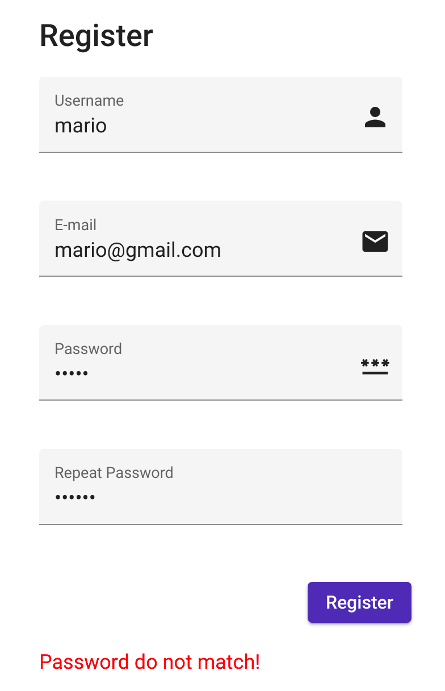
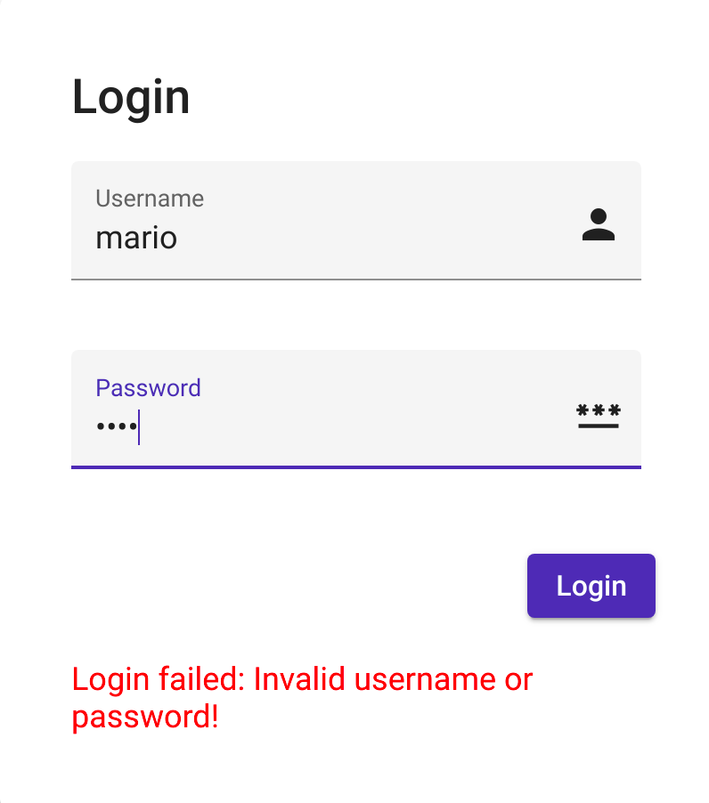
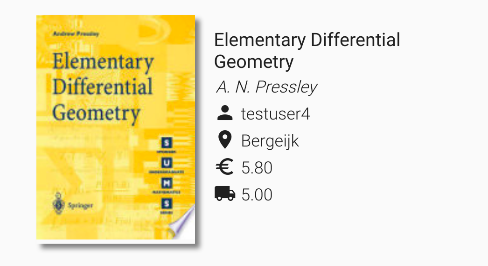
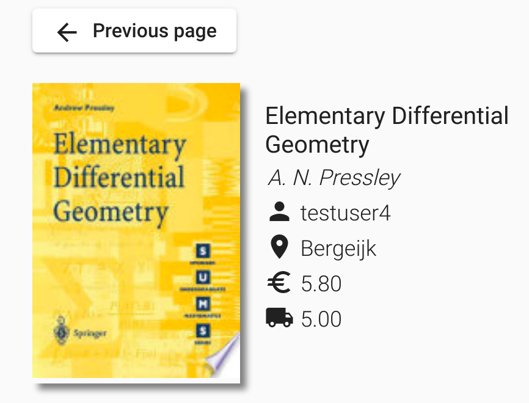

# UX Feedback Report

[TOC]

## Design principles

Check of the Nielsen & Molich design principles:

1. **Visibility of system status**: Currently the application does not display the status during a page transition / loading, but this feature can be easily implemented in the upcoming versions.

2. **Match between system and the real world**: I designed a lot of menus using icons and images that allow the user to recognize instantly their meaning.

3. **User control and freedom**: Users are allowed to change their advertisements' details both during the publishing procedure and later accessing the advertisements history.

4. **Error prevention**: The application performs a check for every required input field and displays an error in case of empty / incorrect values.

5. **Help users recognize, diagnose, and recover from errors**: The application displays errors without using codes or other non-human formats.

   

       
Signup password mismatch error

       

     		
       

   

   

       
Invalid login error

       

     		
       

   

6. **Consistency and standards**: The UI is based on the Angular Material library which offers lots of ready to use components that follow the material design standard.

7. **Recognition rather than recall**: Every menu / component of the application contains all the necessary information useful to the user in order to perform the expected action.

8. **Flexibility and efficiency of use**: The homepage of the website contains some "pre-built" types of advertisements that users could be interested in and both search bar and personal dashboard menu are easily reachable.

9. **Aesthetic and minimalist design**: The homepage and the search advertisement pages contain an overview of the advertisement. Clicking one of them will redirect the user to a more detailed description of the specific insertion. 

10. **Help and Documentation**: I have not provided a user guide for the website, but that cold be a good idea for the future.

## UX design feedback

I asked to both a normal user (my syster) and a member of my group project to provide me with a feedback on the general user experience of my application. At the end of the usage period, they give me the following couple of suggestions to improve the UX:

- insert labels under the topbar icons.
- create a "back button" in the advertisement details page in order to quickly return to the previous page.

## UX updates

- Labels under topbar icons:

  

      
Before feedback

      

    		
      

  

  

      
After feedback

      

    		
      

  

- Back button:

  

      
Before feedback

      

    		
      

  

  

      
After feedback

      

    		
      

  

